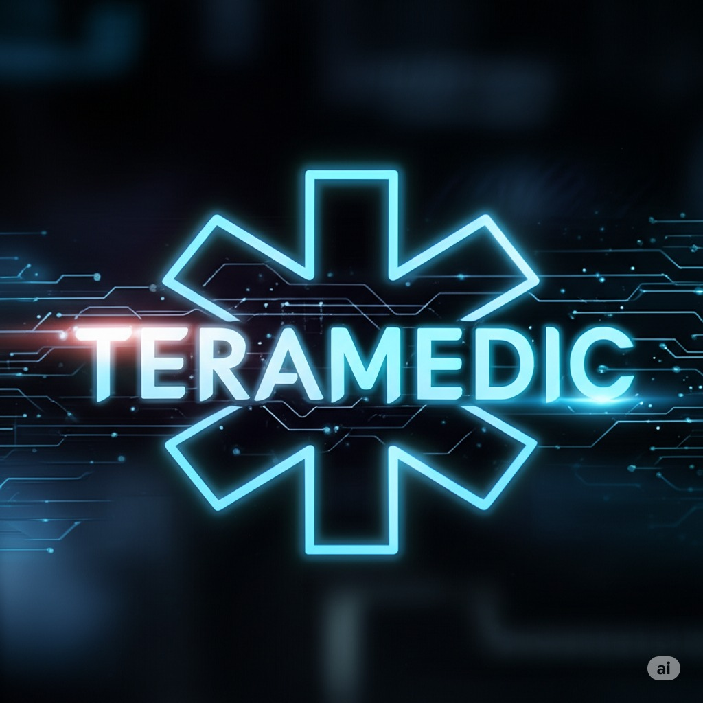

```html
<!DOCTYPE html>
<html lang="es">
<head>
  <meta charset="UTF-8" />
  <meta name="viewport" content="width=device-width, initial-scale=1.0" />
  <title>Teramedic - Terapias Alternativas</title>
  <style>
    body { font-family: Arial, sans-serif; margin: 0; background: #f4f4f4; }
    header { background: #00897b; padding: 20px; color: white; text-align: center; }
    nav a { margin: 0 15px; color: white; text-decoration: none; font-weight: bold; }
    section { padding: 40px 20px; max-width: 900px; margin: auto; background: white; margin-top: 20px; border-radius: 8px; }
    footer { background: #004d40; color: white; text-align: center; padding: 20px; margin-top: 20px; }
    .btn { background: #26a69a; color: white; padding: 12px 20px; border: none; border-radius: 5px; text-decoration: none; }
    .services ul { columns: 2; list-style: square; padding-left: 20px; }
    img.logo { max-width: 150px; margin-top: 10px; }
  </style>
</head>
<body>

<header>
[3/10 17:39] CHAT GPT: 
  <h1>Teramedic - Unidad de Terapias Alternativas</h1>
  <nav>
    <a href="#inicio">Inicio</a>
    <a href="#servicios">Servicios</a>
    <a href="#nosotros">Nosotros</a>
    <a href="#contacto">Contacto</a>
  </nav>
</header>

<section id="inicio">
  <h2>Bienvenidos a Teramedic</h2>
  <p>Ofrecemos terapias alternativas para mejorar tu bienestar físico, emocional y mental. Contamos con años de experiencia en quiropraxia, masajes, logoterapia y más.</p>
  <a href="https://wa.me/593983703127" class="btn" target="_blank">Agendar cita por WhatsApp</a>
</section>

<section id="servicios" class="services">
  <h2>Servicios</h2>
  <ul>
    <li>Masaje terapia</li>
    <li>Logoterapia</li>
    <li>Quiropraxia</li>
    <li>Tratamiento del nervio ciático</li>
    <li>Control de peso</li>
    <li>Dietas personalizadas</li>
    <li>Sueroterapias</li>
    <li>Terapia cero estrés</li>
    <li>Fisioterapia</li>
  </ul>
</section>

<section id="nosotros">
  <h2>Sobre Nosotros</h2>
  <p>Dirigido por el especialista <strong>John Mark Terán</strong>, Teramedic nace con el compromiso de ofrecer alternativas de salud holísticas y efectivas. Nuestro enfoque es humano, personalizado y profesional.</p>
</section>
[3/10 17:39] CHAT GPT: <section id="contacto">
  <h2>Contacto</h2>
  <p>📞 Teléfono: <a href="tel:+593983703127">098 370 3127</a></p>
  <p>📍 Ubicación: Quito, Ecuador</p>
  <p>🌐 Redes sociales:
    <a href="https://facebook.com" target="_blank">Facebook</a> |
    <a href="https://instagram.com" target="_blank">Instagram</a>
  </p>
</section>

<footer>
  <p>&copy; 2025 Teramedic. Todos los derechos reservados.</p>
</footer>

</body>
</html>
```
